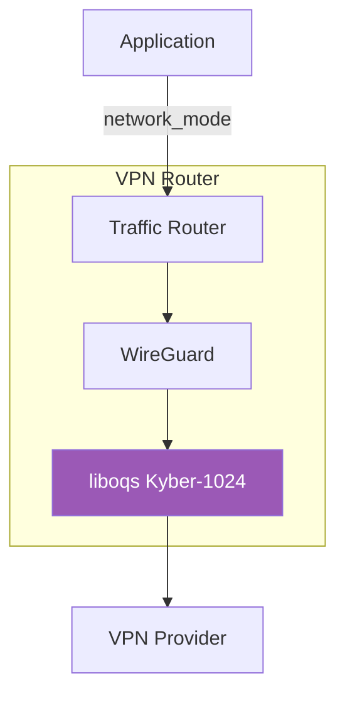

# Post-Quantum VPN Router - Kyber Native

<p align="center">
  <strong>Open Source Post-Quantum VPN Router with Native Kyber-1024</strong>
</p>

<p align="center">
  
  
  
</p>

---

## Overview

Open source implementation of a VPN router with **native Kyber-1024** post-quantum key exchange integrated directly into the WireGuard protocol.

### Features

- Full source code available
- Native Kyber-1024 implementation using liboqs
- Hybrid mode: X25519 + Kyber
- Docker-based deployment
- Cloudflare Tunnel integration

## Quick Start

```bash
git clone https://github.com/vinzabe/post-quantum-vpn-kyber-native.git
cd post-quantum-vpn-kyber-native
./scripts/setup.sh
docker compose up -d
```

## Architecture



## Building from Source

```bash
# Build Kyber-enabled WireGuard
cd vpn-router
docker build -t pqc-vpn-router:latest .

# Run
docker compose up -d
```

## License

MIT License - See LICENSE file.

## Enterprise Support

For enterprise support and custom implementations:

**Email:** grant@abejar.net

---

Developed by Abejar | Open Source Edition
